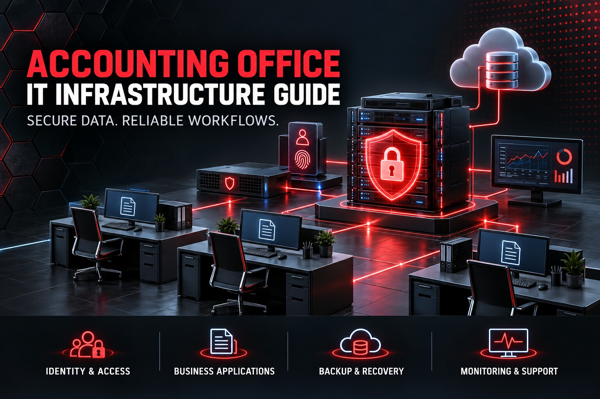

# Accounting Office IT Infrastructure Guide

  

A production-oriented guide for designing, operating, securing, monitoring, backing up, and recovering the IT environment of an accounting office.

This independent guide is published and maintained by [SARABEL Informatika Kft.](https://sarabelinformatika.hu). It combines infrastructure, identity, business-application, remote-access, Microsoft 365, backup, monitoring, and operational controls into one auditable model.

> An accounting application that opens successfully is not proof of a resilient accounting environment. Client data, credentials, databases, document workflows, remote access, backups, patching, and recovery must be designed as one system.

## Design goals

- Protect client, payroll, tax, invoice, and financial data throughout its lifecycle.
- Separate user workstations, servers, management, backup, and guest networks.
- Centralize identities and remove shared administrative accounts.
- Support multi-user accounting applications without bypassing vendor requirements.
- Provide secure remote work through VPN and managed endpoints.
- Keep Microsoft 365, local file services, application databases, and backups under one control model.
- Make every material change reversible and every restore procedure testable.
- Keep included validation scripts read-only.

## Reference architecture

| Layer | Recommended baseline | Responsibility |
|---|---|---|
| Identity | Active Directory or Entra ID with MFA | Users, administrators, service identities, lifecycle |
| Endpoints | Managed Windows 11 devices | Encryption, EDR, patching, application access |
| Session layer | RDS/terminal server where justified | Controlled multi-user application execution |
| Application services | Vendor-supported accounting and payroll applications | Business processing and database consistency |
| File services | Windows file server or managed NAS | Documents, permissions, previous versions |
| Collaboration | Microsoft 365 | Mail, Teams, SharePoint, OneDrive, audit |
| Network | Segmented firewall, managed switching and Wi-Fi | Isolation, VPN, DNS, egress control |
| Backup | Local immutable-capable plus off-site copy | Application, server, Microsoft 365, recovery evidence |
| Monitoring | Infrastructure and service monitoring | Availability, capacity, certificate and backup alerts |
| Operations | Change, incident and acceptance records | Accountability and repeatability |

## Guide map

1. [Scope, data classes, and threat model](docs/01-scope-data-classes-and-threat-model.md)
2. [Discovery and dependency assessment](docs/02-discovery-and-dependency-assessment.md)
3. [Reference architecture and trust boundaries](docs/03-reference-architecture-and-trust-boundaries.md)
4. [Identity, Active Directory, and privileged access](docs/04-identity-active-directory-and-privileged-access.md)
5. [Endpoints, encryption, EDR, and patching](docs/05-endpoints-encryption-edr-and-patching.md)
6. [Accounting applications and database services](docs/06-accounting-applications-and-database-services.md)
7. [File services, permissions, and document workflows](docs/07-file-services-permissions-and-document-workflows.md)
8. [Remote work, VPN, RDS, and secure support](docs/08-remote-work-vpn-rds-and-secure-support.md)
9. [Microsoft 365 and email security](docs/09-microsoft-365-and-email-security.md)
10. [Network segmentation, Wi-Fi, DNS, and firewall](docs/10-network-segmentation-wifi-dns-and-firewall.md)
11. [Backup, retention, immutability, and recovery](docs/11-backup-retention-immutability-and-recovery.md)
12. [Monitoring, logging, and alerting](docs/12-monitoring-logging-and-alerting.md)
13. [Business continuity and incident response](docs/13-business-continuity-and-incident-response.md)
14. [Migration and change control](docs/14-migration-and-change-control.md)
15. [Compliance, suppliers, and evidence](docs/15-compliance-suppliers-and-evidence.md)
16. [Acceptance checklist and operating model](docs/16-acceptance-checklist-and-operating-model.md)

## Quick start

1. Copy [assessment-workbook.md](templates/assessment-workbook.md) and identify owners, users, locations, software, databases, integrations, RTO, and RPO.
2. Build an application dependency map before moving or upgrading any accounting system.
3. Run the read-only endpoint/server inventory:

~~~powershell
powershell.exe -ExecutionPolicy Bypass -File .\scripts\Collect-AccountingOfficeInventory.ps1
~~~

4. Run the read-only Linux/network preflight where applicable:

~~~bash
sudo ./scripts/accounting-office-network-preflight.sh
~~~

5. Complete the backup coverage matrix and perform an isolated restore test.
6. Record technical validation and business approval in [acceptance-record.md](templates/acceptance-record.md).

## Supported business applications

The control model can be applied to environments using RLB-60, Novitax, Kulcs-Soft, Tensoft, Számlázz.hu, Cashbook, VIKI, ÁNYK, and comparable accounting, payroll, invoicing, and document-processing products.

Product names belong to their respective owners. This repository does not replace vendor documentation, licensing terms, support instructions, database requirements, or application-specific backup procedures.

## Included operational assets

### Read-only scripts

- Windows endpoint/server inventory and security posture report
- Backup target freshness and capacity report
- DNS, gateway, time, and required-port network preflight
- Microsoft 365 tenant assessment checklist generator

### Templates

- Initial assessment workbook
- Application dependency register
- Access and role matrix
- Backup coverage matrix
- Migration/change record
- Incident runbook
- Recovery test record
- Acceptance record

The scripts collect evidence only. They do not install software, change policies, modify firewall rules, restart systems, create users, rotate credentials, or delete data.

## Security principles

- Use named accounts, MFA, least privilege, and separate administrative identities.
- Keep line-of-business databases off user workstations whenever a supported server architecture exists.
- Do not expose RDP, SMB, database, NAS, hypervisor, or management interfaces directly to the Internet.
- Encrypt managed endpoints and protect recovery keys.
- Treat application exports, payroll files, tax data, database backups, Microsoft 365 exports, and remote-support logs as sensitive.
- Maintain versioned local and off-site backups, and prove recoverability.
- Monitor backup age, server capacity, identity events, endpoint protection, certificates, and critical services.
- Document exceptions with an owner, compensating control, expiry date, and review.

## Project status

Version 1.0.0 is the initial production-oriented baseline. See [ROADMAP.md](ROADMAP.md), [CHANGELOG.md](CHANGELOG.md), and [SUPPORTED_VERSIONS.md](SUPPORTED_VERSIONS.md).

## About SARABEL Informatika

[SARABEL Informatika Kft.](https://sarabelinformatika.hu) designs and operates secure business IT infrastructure, including Windows and Linux servers, Proxmox virtualization, Microsoft 365, networking, VPN, Synology and QNAP storage, monitoring, backup, and recovery.

For an accounting-office assessment, application migration, secure remote-access project, backup review, or managed IT operation, visit [sarabelinformatika.hu](https://sarabelinformatika.hu).

## License and independence

Documentation, scripts, and original examples are released under the [MIT License](LICENSE). This repository is an independent SARABEL Informatika publication and is not affiliated with or endorsed by the named software vendors.
